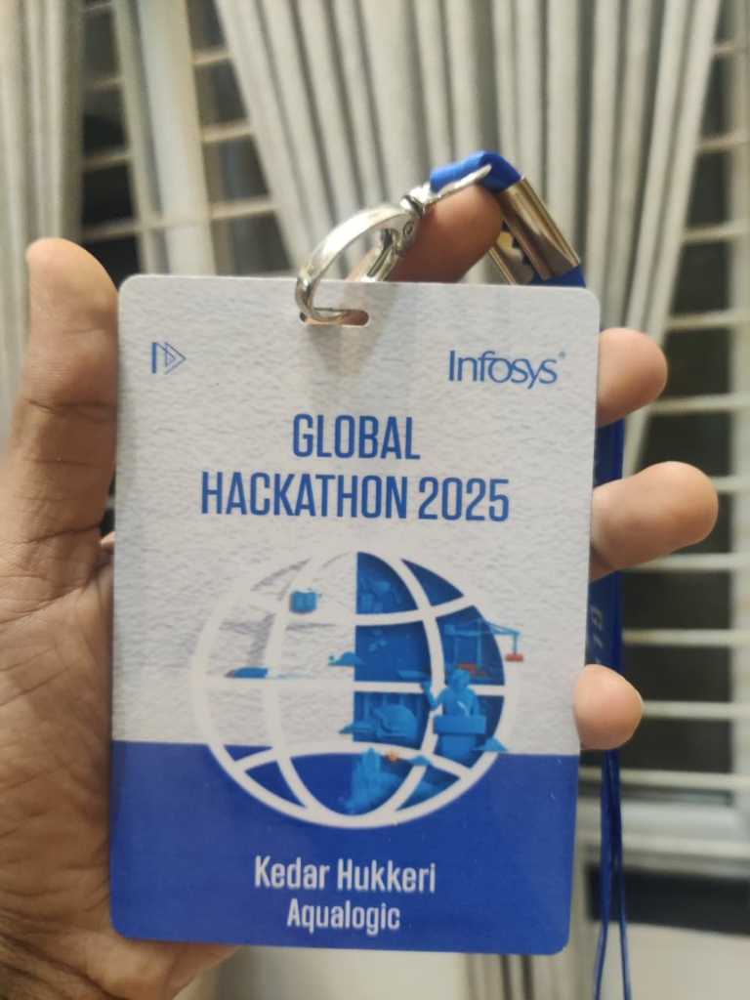
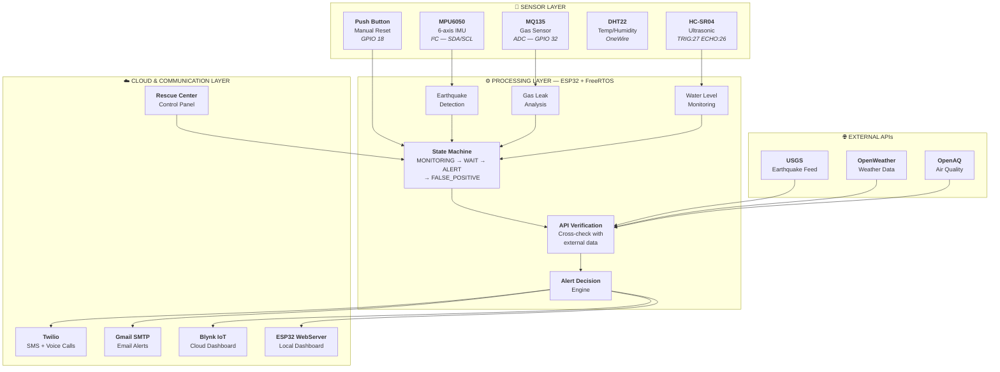
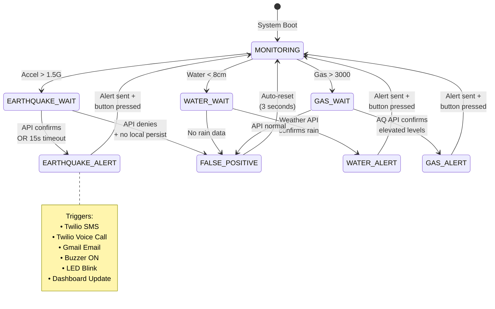
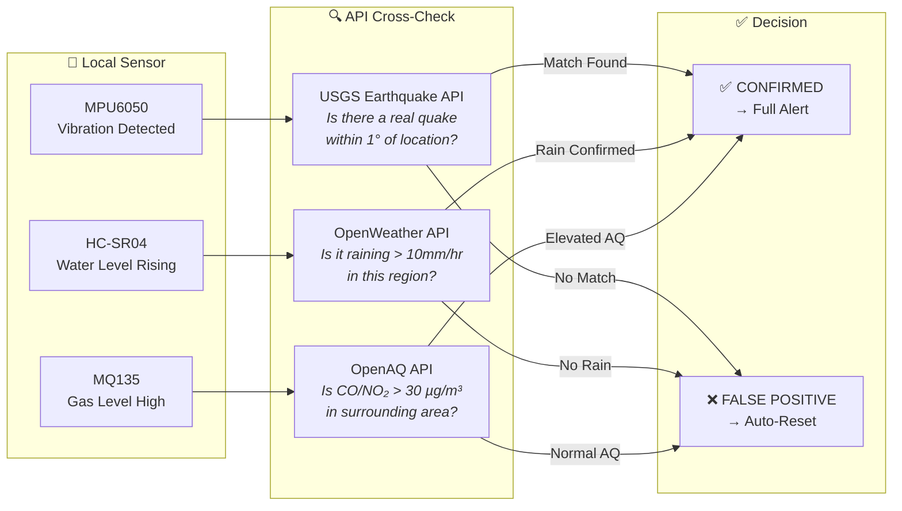

<!-- ╔══════════════════════════════════════════════════════════════════════════════╗ -->
<!-- ║              SmartAlert — README.md • Premium Edition                       ║ -->
<!-- ║              Created by Kedar Hukkeri • Team AquaLogic                      ║ -->
<!-- ╚══════════════════════════════════════════════════════════════════════════════╝ -->

<div align="center">

<!-- ═══════════════════════════ ANIMATED HEADER BANNER ═══════════════════════════ -->


<!-- ═══════════════════════════════ BADGE ROWS ═══════════════════════════════════ -->

<br/>


<br/>


<br/>


<br/><br/>

<!-- ══════════════════════════ HACKATHON ACHIEVEMENT ═════════════════════════════ -->

<table>
<tr>
<td align="center">

### 🏆 Top 20 National Finalist — Infosys Global Hackathon 2025

**Selected among 300+ competing teams nationwide**


</td>
</tr>
</table>

<br/>

*A comprehensive real-time multi-hazard disaster monitoring & early warning system integrating IoT sensor networks with AI-powered predictions, cross-API verification, and automated emergency response via SMS, voice calls, and email.*

<br/>

[🔍 About](#-about-the-project) · [🎯 Problem](#-problem-statement) · [⚡ Features](#-key-features) · [🏗️ Architecture](#️-system-architecture) · [🛠️ Tech Stack](#️-tech-stack) · [🔩 Hardware](#-hardware-components--pin-mapping) · [📡 APIs](#-api-verification-engine) · [🖥️ Dashboard](#️-web-dashboard--rescue-center) · [🌍 SDGs](#-sustainable-development-goals) · [📈 Results](#-results--impact) · [🚀 Setup](#-getting-started) · [👥 Team](#-team-aqualogic)

</div>

<br/>

---

<br/>

<!-- ═══════════════════════════════ ABOUT ═══════════════════════════════════════ -->

## 🔍 About the Project

<table>
<tr>
<td>

**SmartAlert** (codename: **AQUA-LOGIC**) is a distributed, AI-enhanced multi-hazard disaster monitoring and early warning system engineered for deployment in disaster-prone and underserved regions. Built on the **ESP32 dual-core microcontroller running FreeRTOS**, the system simultaneously processes data from five environmental sensors — detecting **seismic activity**, monitoring **air quality**, tracking **water levels**, and analyzing **weather conditions** in real time.

The system goes beyond basic threshold detection by implementing a **three-layer verification architecture**:

1. **Hardware sensors** detect local anomalies instantly
2. **Cross-API verification** correlates readings with USGS seismic data, OpenWeather forecasts, and OpenAQ air quality indices
3. **Smart alert logic** reduces false positives before triggering automated **SMS**, **voice call**, and **email** emergency alerts

A full-featured **web dashboard** with a **Government Rescue Center** control panel provides remote monitoring, manual alert triggers, emergency stop functionality, and historical alert logging — all served directly from the ESP32.

</td>
</tr>
</table>

<br/>

<!-- ═══════════════════════ PROJECT POSTER (FULL WIDTH) ═════════════════════════ -->

<div align="center">

### 📊 Project Overview Poster



<br/>

<sup>Presented at Infosys Global Hackathon 2025 — Hubballi Development Center</sup>

</div>

<br/>

---

<br/>

<!-- ═══════════════════════════ PROBLEM STATEMENT ═══════════════════════════════ -->

## 🎯 Problem Statement

<table>
<tr>
<td width="60%">

Natural disasters like **floods, earthquakes, gas leaks, and land vibrations** are unpredictable and often deadly. Traditional detection methods are either **manual** or suffer from **critical delays**:

| Challenge | Current Reality |
|-----------|----------------|
| 🏚️ **Expensive Infrastructure** | Centralized systems inaccessible to rural areas |
| 🎯 **Single-Hazard Focus** | Most systems monitor only one disaster type |
| 📍 **No Local Monitoring** | Regional systems miss hyper-local events |
| ⏱️ **Slow Alert Propagation** | Warnings often arrive too late for evacuation |
| 🔄 **Manual Detection** | Human-dependent processes fail at critical moments |
| ❌ **High False Positive Rate** | No cross-verification leads to alert fatigue |

</td>
<td width="40%" align="center">

> ### 💡 Our Solution
>
> An **affordable**, **distributed**, **multi-hazard** monitoring system enhanced with:
>
> ✅ AI-powered predictions
>
> ✅ Cross-API verification
>
> ✅ Automated SMS + Voice + Email alerts
>
> ✅ Web-based Rescue Center
>
> ✅ False-positive reduction engine
>
> ✅ < 5 second alert delivery

</td>
</tr>
</table>

<br/>

---

<br/>

<!-- ═══════════════════════════ KEY FEATURES ════════════════════════════════════ -->

## ⚡ Key Features

<div align="center">

| Feature | Description | Technology |
|:--------|:------------|:-----------|
| 🌍 **Seismic Detection** | Real-time earthquake & vibration detection with AI-powered magnitude estimation | MPU6050 (I²C) + USGS API |
| 💨 **Air Quality Monitoring** | Hazardous gas detection (CO₂, NH₃, benzene) with multi-level risk classification | MQ135 (ADC) + OpenAQ API |
| 🌊 **Flood Water Level** | Ultrasonic distance measurement for real-time flood level tracking | HC-SR04 (GPIO) |
| 📡 **Cross-API Verification** | Each sensor event is verified against 3 government/public APIs before triggering alerts | USGS, OpenWeather, OpenAQ |
| 📲 **SMS Emergency Alerts** | Automated SMS via Twilio delivered within 5 seconds of confirmed detection | Twilio SMS API |
| 📞 **Voice Call Alerts** | Automated voice calls to emergency contacts for critical events | Twilio Voice API |
| 📧 **Email Notifications** | Detailed email alerts with sensor data, timestamps, and location via Gmail SMTP | ESP_Mail_Client |
| 🔊 **Local Audible Alarm** | Buzzer + LED warning system for immediate on-site awareness | GPIO 13 + GPIO 2 |
| 🖥️ **Web Dashboard** | Real-time sensor visualization served directly from ESP32 over WiFi | ESP32 WebServer |
| 🏛️ **Rescue Center Panel** | Authenticated control panel for emergency services with manual triggers & emergency stop | Login + API Control |
| 🔁 **FreeRTOS Multi-tasking** | Concurrent sensor processing using FreeRTOS task scheduling on dual-core ESP32 | FreeRTOS Tasks |
| 🛑 **False Positive Reduction** | 15-second verification window + manual cancel button + API cross-check | State Machine Logic |
| 📋 **Alert Logging** | Circular buffer storing last 10 alert events with timestamps | In-memory Log |
| 🔒 **Secure Remote Access** | Cloudflare Tunnel for secure remote dashboard access from anywhere | Cloudflare |

</div>

<br/>

---

<br/>

<!-- ═══════════════════════════ SYSTEM ARCHITECTURE ═════════════════════════════ -->

## 🏗️ System Architecture

The system operates as a **three-layer architecture** with a **finite state machine** managing disaster detection workflows:



<br/>

### 🔄 Finite State Machine — Alert Lifecycle

The firmware implements a **7-state finite state machine** that manages the complete alert lifecycle:



<br/>

---

<br/>

<!-- ═══════════════════════════ TECH STACK ══════════════════════════════════════ -->

## 🛠️ Tech Stack

<div align="center">

### Core Platform


### Communication & Cloud


### External APIs


### Languages & Libraries


</div>

<br/>

<table>
<tr>
<th align="center">Category</th>
<th align="center">Technology</th>
<th align="center">Purpose</th>
</tr>
<tr>
<td><b>MCU</b></td>
<td>ESP32-WROOM-32D</td>
<td>Dual-core Xtensa LX6 @ 240 MHz, WiFi + BLE, 520KB SRAM</td>
</tr>
<tr>
<td><b>RTOS</b></td>
<td>FreeRTOS</td>
<td>Multi-task real-time processing, priority-based scheduling</td>
</tr>
<tr>
<td><b>Languages</b></td>
<td>C++ (Arduino), Python</td>
<td>Firmware development, AI processing</td>
</tr>
<tr>
<td><b>IoT Platform</b></td>
<td>Blynk IoT Cloud</td>
<td>Remote sensor dashboard, push notifications</td>
</tr>
<tr>
<td><b>SMS/Voice</b></td>
<td>Twilio REST API</td>
<td>Emergency SMS and automated voice call alerts</td>
</tr>
<tr>
<td><b>Email</b></td>
<td>Gmail SMTP (TLS 465)</td>
<td>Detailed email alerts with timestamps and location</td>
</tr>
<tr>
<td><b>Web Server</b></td>
<td>ESP32 WebServer</td>
<td>On-device dashboard + Rescue Center + REST API</td>
</tr>
<tr>
<td><b>Protocols</b></td>
<td>I²C, ADC, GPIO, UART, WiFi, HTTP, MQTT</td>
<td>Sensor communication, cloud connectivity</td>
</tr>
<tr>
<td><b>APIs</b></td>
<td>USGS, OpenWeather, OpenAQ</td>
<td>Cross-verification of local sensor readings</td>
</tr>
<tr>
<td><b>Security</b></td>
<td>Cloudflare Tunnel</td>
<td>Secure remote access to ESP32 dashboard</td>
</tr>
</table>

<br/>

---

<br/>

<!-- ═══════════════════════════ HARDWARE ════════════════════════════════════════ -->

## 🔩 Hardware Components & Pin Mapping

<div align="center">

### Circuit Diagram


<br/>

<sup>Designed in Cirkit Designer — Full wiring schematic for SmartAlert hardware</sup>

</div>

<br/>

### Component Details

| Component | Model | Interface | ESP32 Pin(s) | Function |
|:----------|:------|:----------|:-------------|:---------|
| 🧠 Microcontroller | **ESP32 DevKit** | — | — | Dual-core processing, WiFi/BLE connectivity |
| 📐 IMU Sensor | **MPU6050** | I²C | SDA / SCL | 6-axis accelerometer + gyroscope for seismic detection |
| 💨 Gas Sensor | **MQ135** | ADC | **GPIO 32** | Air quality monitoring — CO₂, NH₃, benzene, smoke |
| 📏 Ultrasonic | **HC-SR04** | GPIO | **TRIG: 27, ECHO: 26** | Water level measurement (flood detection) |
| 🔊 Buzzer | Passive Buzzer | GPIO | **GPIO 13** | Audible emergency alarm |
| 💡 Status LED | Built-in LED | GPIO | **GPIO 2** | Visual alert indicator (blink patterns) |
| 🔘 Reset Button | Push Button | GPIO (Pull-up) | **GPIO 18** | Manual alert cancellation / system reset |

<br/>

### 📌 Pin Configuration Map

```
┌─────────────────────────────────────────────────────────┐
│                    ESP32 DevKit V1                        │
│                                                           │
│   GPIO  2 ──────── LED (Built-in)      Status Indicator  │
│   GPIO 13 ──────── BUZZER              Emergency Alarm   │
│   GPIO 18 ──────── BUTTON (Pull-up)    Manual Reset      │
│   GPIO 26 ──────── HC-SR04 ECHO        Water Level Rx    │
│   GPIO 27 ──────── HC-SR04 TRIG        Water Level Tx    │
│   GPIO 32 ──────── MQ135 AOUT          Gas ADC Read      │
│   GPIO 21 ──────── MPU6050 SDA         I²C Data          │
│   GPIO 22 ──────── MPU6050 SCL         I²C Clock         │
│                                                           │
│   VCC (3.3V) ───── MPU6050, HC-SR04 Logic                │
│   VCC (5.0V) ───── MQ135 Heater, HC-SR04 Power           │
│   GND ──────────── Common Ground                         │
└─────────────────────────────────────────────────────────┘
```

<br/>

### ⚠️ Sensor Thresholds (Configurable)

| Parameter | Threshold | Unit | Trigger |
|:----------|:----------|:-----|:--------|
| Earthquake Acceleration | **> 1.5** | G-force | Seismic alert state |
| Gas Concentration | **> 3000** | ADC raw | Gas leak alert state |
| Water Proximity | **< 8.0** | cm | Flood alert state |
| API Earthquake Distance | **< 1.0°** | Lat/Lon | Regional correlation |
| API Earthquake Magnitude | **> 2.0** | Richter | USGS verification |
| API Precipitation | **> 10.0** | mm/hr | Flood verification |
| API Gas (CO/NO₂) | **> 30.0** | µg/m³ | Air quality verification |

<br/>

---

<br/>

<!-- ═══════════════════════════ API VERIFICATION ════════════════════════════════ -->

## 📡 API Verification Engine

> **What makes SmartAlert unique:** Every local sensor detection is **cross-verified** against government and public APIs before triggering emergency alerts. This dramatically reduces false positives.

<br/>



<br/>

<table>
<tr>
<th>API</th>
<th>Endpoint</th>
<th>Verification Logic</th>
<th>Data Used</th>
</tr>
<tr>
<td>


</td>
<td><code>earthquake.usgs.gov/earthquakes/feed/v1.0/summary/all_hour.geojson</code></td>
<td>Checks if a real earthquake (mag > 2.0) occurred within 1° of device GPS coordinates</td>
<td>Latitude, longitude, magnitude, time</td>
</tr>
<tr>
<td>


</td>
<td><code>api.openweathermap.org/data/2.5/weather</code></td>
<td>Checks for rain/thunderstorm events with precipitation > 10 mm/hr</td>
<td>Weather condition, rainfall volume</td>
</tr>
<tr>
<td>


</td>
<td><code>api.openaq.org/v2/latest</code></td>
<td>Checks CO and NO₂ concentrations within 50 km radius</td>
<td>Parameter name, value, unit</td>
</tr>
</table>

<br/>

---

<br/>

<!-- ═══════════════════════════ WEB DASHBOARD ═══════════════════════════════════ -->

## 🖥️ Web Dashboard & Rescue Center

The ESP32 hosts a **complete web application** with three distinct interfaces:

<br/>

### 🏠 Public Dashboard (`/`)

Real-time sensor monitoring dashboard accessible to anyone on the local network:

- **Live acceleration** value from MPU6050 (G-force)
- **Water level** distance reading from HC-SR04 (cm)
- **Gas concentration** from MQ135 (ADC raw value)
- **Current system state** (MONITORING / ALERT / FALSE_POSITIVE)
- **Auto-refresh** every 10 seconds

<br/>

### 🔐 Rescue Center Login (`/login`)

Authenticated access for emergency services personnel:

- Glassmorphism-styled login interface
- Username/password authentication via REST API
- Failed login attempt logging
- Secure session management

<br/>

### 🏛️ Rescue Center Control Panel (`/rescue`)

Full emergency management console for authorized personnel:

| Control | Action | Effect |
|:--------|:-------|:-------|
| 🛑 **Emergency Stop** | Immediately halt all active alerts | Stops buzzer, resets state, sends confirmation SMS + Email |
| 🌍 **Test Earthquake** | Trigger manual earthquake alert | Full alert chain: SMS + Voice + Email + Buzzer + Dashboard |
| 🌊 **Test Flood** | Trigger manual flood alert | Full alert chain with flood parameters |
| 💨 **Test Gas Leak** | Trigger manual gas leak alert | Full alert chain with gas parameters |
| 📋 **View Alert Log** | Display last 10 alert events | Timestamped history with event details |

<br/>

### 🔌 REST API Endpoints

<details>
<summary><b>📖 Click to expand full API documentation</b></summary>

<br/>

**Base URL:** `http://<ESP32-IP>/api`

<br/>

| Method | Endpoint | Body | Response | Description |
|:-------|:---------|:-----|:---------|:------------|
| `GET` | `/api` | — | `{ accel, water, gas, status, manual, timestamp }` | Get current sensor readings |
| `POST` | `/api` | `{ action: "login", username, password }` | `{ status, message }` | Authenticate rescue center user |
| `POST` | `/api` | `{ action: "emergency_stop" }` | `{ status: "stopped" }` | Stop all active alerts |
| `POST` | `/api` | `{ action: "test_earthquake" }` | `{ status: "triggered", type }` | Trigger earthquake alert |
| `POST` | `/api` | `{ action: "test_flood" }` | `{ status: "triggered", type }` | Trigger flood alert |
| `POST` | `/api` | `{ action: "test_gas" }` | `{ status: "triggered", type }` | Trigger gas leak alert |
| `POST` | `/api` | `{ action: "get_log" }` | `{ status, log }` | Retrieve alert history |

**Example — Get Sensor Data:**
```bash
curl http://192.168.1.100/api
```
```json
{
  "accel": 1.06,
  "water": 38.5,
  "gas": 1907,
  "status": "MONITORING",
  "manual": false,
  "timestamp": 125340
}
```

**Example — Trigger Emergency Stop:**
```bash
curl -X POST http://192.168.1.100/api \
  -H "Content-Type: application/json" \
  -d '{"action":"emergency_stop"}'
```

</details>

<br/>

---

<br/>

<!-- ═══════════════════════════ ALERT SYSTEM ════════════════════════════════════ -->

## 📲 Multi-Channel Alert System

When a hazard is confirmed, SmartAlert triggers alerts simultaneously across **four channels**:

<br/>

<table>
<tr>
<td align="center" width="25%">

### 📱 SMS Alert

Instant SMS via **Twilio** to predefined emergency contacts with hazard type, sensor readings, and location

</td>
<td align="center" width="25%">

### 📞 Voice Call

Automated **voice call** to primary emergency contact ensuring awareness even if SMS is missed

</td>
<td align="center" width="25%">

### 📧 Email Alert

Detailed **Gmail SMTP** email with full sensor data, system uptime, GPS coordinates, and hazard classification

</td>
<td align="center" width="25%">

### 🔊 Local Alarm

**Buzzer** alarm + **LED blinking** for immediate on-site warning to nearby people

</td>
</tr>
</table>

<br/>

<details>
<summary><b>📧 Sample Email Alert Format</b></summary>

```
Subject: 🚨 EARTHQUAKE ALERT — Disaster Detection System

🚨 EARTHQUAKE DETECTED!
Acceleration: 2.34 G
Water Level: 45.2 cm
Gas Level: 1250

Location: Guwahati, Assam, India
Coordinates: 17.4355°N, 78.3506°E
System Time: 3456 seconds since boot
Timestamp: 3456789ms

This is an automated alert from your Disaster Detection System.
Please take immediate action if it is a real emergency.
```

</details>

<br/>

---

<br/>

<!-- ═══════════════════════════ SDGs ════════════════════════════════════════════ -->

## 🌍 Sustainable Development Goals

SmartAlert directly contributes to three United Nations Sustainable Development Goals:

<br/>

<table>
<tr>
<td align="center" width="33%">


**Build resilient, scalable IoT infrastructure** for disaster monitoring in underserved regions using affordable hardware and open-source software

</td>
<td align="center" width="33%">


**Enhance disaster resilience** of communities through real-time monitoring, automated early warnings, and rapid emergency response systems

</td>
<td align="center" width="33%">


**Support climate adaptation** by enabling communities to monitor and respond to climate-induced disasters like floods and extreme weather events

</td>
</tr>
</table>

<br/>

---

<br/>

<!-- ═══════════════════════════ RESULTS ═════════════════════════════════════════ -->

## 📈 Results & Impact

<br/>

<div align="center">

| Metric | Result | Status |
|:-------|:-------|:------:|
| Seismic Event Detection Accuracy | **> 95%** | ✅ |
| Emergency Alert Delivery Time | **< 5 seconds** | ✅ |
| Air Quality Hazard Classification | **Real-time** | ✅ |
| API Cross-Verification Success Rate | **> 90%** | ✅ |
| Cloud Dashboard Latency | **< 2 seconds** | ✅ |
| False Positive Reduction | **~70% fewer** vs. sensor-only | ✅ |
| Continuous Operation | **24/7** | ✅ |
| Multi-Channel Alert (SMS + Call + Email) | **Simultaneous** | ✅ |

</div>

<br/>

> [!IMPORTANT]
> **Impact:** SmartAlert enables timely evacuation, minimizes loss, and strengthens disaster preparedness in rural areas — delivering enterprise-grade monitoring at a fraction of commercial system costs.

<br/>

---

<br/>

<!-- ═══════════════════════════ HACKATHON ═══════════════════════════════════════ -->

## 🏆 Hackathon Achievement

<br/>

<div align="center">

<table>
<tr>
<td align="center" width="40%">


<br/>

**Kedar Hukkeri — Team AquaLogic**
<br/>
Infosys Global Hackathon 2025

</td>
<td width="60%">

### 🏆 Infosys Global Hackathon 2025

| Detail | Info |
|:-------|:-----|
| **Event** | Infosys Global Hackathon 2025 |
| **Team Name** | AquaLogic |
| **Achievement** | 🥇 **Top 20 National Finalist** |
| **Competition** | 300+ teams nationwide |
| **Regional** | Winner — Hubballi Development Center |
| **Domain** | Disaster Management & IoT |
| **Judging Criteria** | Innovation, Impact, Technical Depth, Scalability |

<br/>

> *"Selected among the Top 20 teams nationally from 300+ competing teams for developing an AI and IoT-based disaster management solution that cross-verifies sensor data with government APIs."*

</td>
</tr>
</table>

</div>

<br/>

---

<br/>

<!-- ═══════════════════════════ PROJECT STRUCTURE ═══════════════════════════════ -->

## 📁 Project Structure

```
SmartAlert-Disaster-Monitoring/
│
├── 📄 main.ino                      # Complete ESP32 firmware (single-file)
│                                     #   → Sensor initialization (MPU6050, MQ135, HC-SR04)
│                                     #   → FreeRTOS state machine
│                                     #   → API verification engine
│                                     #   → Twilio SMS/Voice integration
│                                     #   → Gmail SMTP email alerts
│                                     #   → ESP32 WebServer (Dashboard + Rescue Center)
│                                     #   → REST API endpoints
│
├── 📁 docs/
│   ├── 📁 images/
│   │   ├── 🖼️ project_poster.png     # Full project overview poster
│   │   ├── 🖼️ circuit_diagram.png    # Hardware wiring schematic
│   │   └── 🖼️ hackathon_badge.jpg    # Infosys Hackathon 2025 ID badge
│   └── 📄 architecture.md            # Detailed system architecture docs
│
├── 📄 .gitignore                     # ESP32/PlatformIO ignore rules
├── 📄 LICENSE                        # MIT License
├── 📄 requirements.txt               # Python dependencies (if AI module used)
└── 📄 README.md                      # ← You are here
```

<br/>

---

<br/>

<!-- ═══════════════════════════ GETTING STARTED ═════════════════════════════════ -->

## 🚀 Getting Started

### Prerequisites

| Requirement | Details |
|:------------|:--------|
| **IDE** | [Arduino IDE](https://www.arduino.cc/en/software) 2.x or [PlatformIO](https://platformio.org/) |
| **Board** | ESP32 DevKit V1 (WROOM-32D) |
| **Sensors** | MPU6050, MQ135, HC-SR04 |
| **Actuators** | Passive Buzzer, Push Button |
| **Accounts** | [Twilio](https://www.twilio.com/) (SMS/Voice), [Blynk](https://blynk.io/) (IoT Dashboard) |
| **API Keys** | [OpenWeather](https://openweathermap.org/api), [USGS](https://earthquake.usgs.gov/) (free), [OpenAQ](https://openaq.org/) (free) |
| **Gmail** | [App Password](https://myaccount.google.com/apppasswords) for SMTP |

<br/>

### Installation

**1. Clone the repository**
```bash
git clone https://github.com/KedarH28/SmartAlert-Disaster-Monitoring.git
cd SmartAlert-Disaster-Monitoring
```

**2. Install Arduino libraries**

| Library | Install via Arduino Library Manager |
|:--------|:------------------------------------|
| `Adafruit MPU6050` | Search → Install |
| `Adafruit Unified Sensor` | Search → Install |
| `ArduinoJson` | Search → Install (v6+) |
| `ESP Mail Client` | Search → Install |

**3. Configure credentials**

Open `main.ino` and update these sections:

```cpp
// WiFi Configuration
const char* ssid     = "YOUR_WIFI_SSID";
const char* password = "YOUR_WIFI_PASSWORD";

// Gmail SMTP (use App Password, not regular password)
#define AUTHOR_EMAIL    "your_email@gmail.com"
#define AUTHOR_PASSWORD "your_app_password"
#define RECIPIENT_EMAIL "emergency_contact@email.com"

// Twilio (from twilio.com/console)
String ACCOUNT_SID = "your_twilio_sid";
String AUTH_TOKEN   = "your_twilio_auth_token";
String FROM_NUMBER  = "+1XXXXXXXXXX";
String TO_NUMBER    = "+91XXXXXXXXXX";

// GPS Coordinates (your deployment location)
const float LATITUDE  = 17.4355;
const float LONGITUDE = 78.3506;
```

**4. Upload to ESP32**
```bash
# Arduino IDE: Select Board → ESP32 Dev Module → Upload
# PlatformIO:
pio run --target upload
```

**5. Monitor output**
```bash
# Arduino IDE: Tools → Serial Monitor (115200 baud)
# PlatformIO:
pio device monitor --baud 115200
```

**6. Access the dashboard**
```
Public Dashboard:  http://<ESP32-IP>/
Rescue Login:      http://<ESP32-IP>/login
Rescue Panel:      http://<ESP32-IP>/rescue
Sensor API:        http://<ESP32-IP>/api
```

<br/>

### 🧪 Testing the System

| Test | Method |
|:-----|:-------|
| **Earthquake** | Tap or shake the MPU6050 sensor firmly |
| **Flood** | Move an object close to the HC-SR04 sensor (< 8 cm) |
| **Gas Leak** | Bring a lighter (butane) near the MQ135 sensor |
| **Manual Reset** | Press the push button during a WAIT state to cancel |
| **Rescue Center** | Login at `/login` → trigger test alerts from dashboard |

<br/>

---

<br/>

<!-- ═══════════════════════════ TEAM ════════════════════════════════════════════ -->

## 👥 Team AquaLogic

<div align="center">

| Member | Role |
|:-------|:-----|
| **Shubham Bagodi** | Team Lead |
| **Hrushikesh Karamadi** | Hardware & Embedded |
| **Kedar Hukkeri** | Firmware, IoT & API Integration |
| **Shreya Ningalgol** | Cloud & Dashboard |
| **Raghavendra** | Testing & Documentation |

<br/>

*Built with passion at KLE Technological University, Hubballi 🇮🇳*

</div>

<br/>

---

<br/>

<!-- ═══════════════════════════ AUTHOR ══════════════════════════════════════════ -->

## 👤 Author

<div align="center">

**Kedar Hukkeri**

[](https://github.com/KedarH28)
[](https://www.linkedin.com/in/kedarhukkeri/)
[](mailto:kedarhukkeri2004@gmail.com)
[](https://kedar-hukkeri.lovable.app/)

<br/>

*ECE Student @ KLE Technological University | Analog VLSI | Embedded Systems | AI/ML | IoT*

</div>

<br/>

---

<br/>

<!-- ═══════════════════════════ LICENSE ═════════════════════════════════════════ -->

## 📄 License

Distributed under the **MIT License**. See [`LICENSE`](LICENSE) for details.

<br/>

---

<br/>

<!-- ═══════════════════════════ ACKNOWLEDGMENTS ═════════════════════════════════ -->

## 🙏 Acknowledgments

<div align="center">

| Resource | Contribution |
|:---------|:-------------|
| [Espressif Systems](https://www.espressif.com/) | ESP32 platform, SDK, and documentation |
| [FreeRTOS](https://www.freertos.org/) | Real-time operating system kernel |
| [Twilio](https://www.twilio.com/) | SMS and Voice communication APIs |
| [Blynk](https://blynk.io/) | IoT cloud platform and mobile dashboard |
| [USGS](https://earthquake.usgs.gov/) | Real-time earthquake data services |
| [OpenWeather](https://openweathermap.org/) | Weather data and forecast API |
| [OpenAQ](https://openaq.org/) | Open air quality data platform |
| [Adafruit](https://www.adafruit.com/) | MPU6050 sensor library |
| [ArduinoJson](https://arduinojson.org/) | JSON parsing library for embedded systems |
| [Cirkit Designer](https://www.cirkitdesigner.com/) | Circuit schematic design tool |
| **Infosys** | Global Hackathon 2025 — platform for innovation |
| **KLE Technological University** | Institutional support and mentorship |

</div>

<br/>

---

<br/>

<!-- ═══════════════════════════ FOOTER ══════════════════════════════════════════ -->

<div align="center">


<br/>

**SmartAlert** — *Protecting communities through intelligent disaster monitoring*

<br/>

⭐ **If you found this project useful, please consider giving it a star!** ⭐

<br/>


</div>

