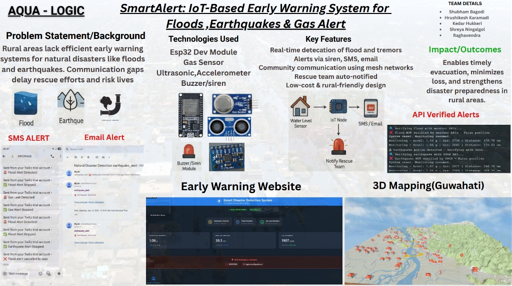
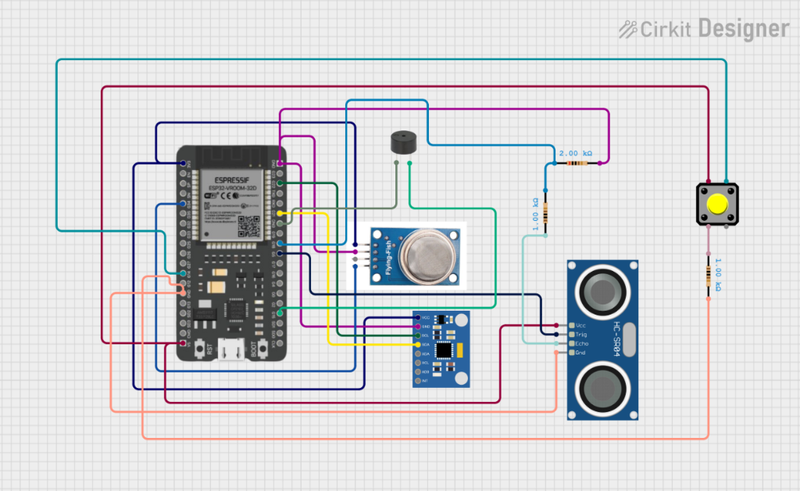
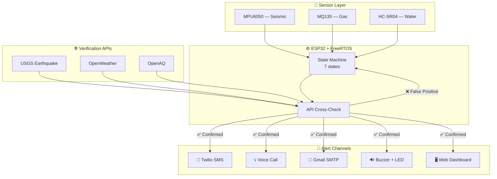
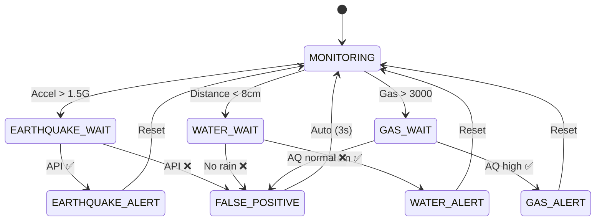

<p align="center">
  
</p>

<h3 align="center">
  <samp>
    &gt; Built by <b><a target="_blank" href="https://www.linkedin.com/in/kedarhukkeri/">Team AquaLogic</a></b> — Infosys Global Hackathon 2025
  </samp>
</h3>

<br>

<p align="center">
  
</p>

<p align="center">
  
</p>

<p align="center">
  
  
  
  
  
  
  
  
  
</p>

[](https://github.com/KedarH28)

<!-- ═══════════════════════ PROJECT POSTER ═══════════════════════ -->

<p align="center">
  
</p>

<p align="center">
  <samp><i>Presented at Infosys Global Hackathon 2025 — Hubballi Development Center</i></samp>
</p>

[](https://github.com/KedarH28)

## 🎯 What is SmartAlert?

> **SmartAlert** is a distributed disaster monitoring system that detects **earthquakes**, **floods**, and **gas leaks** using ESP32 + multi-sensor hardware, then **cross-verifies** each event against government APIs (USGS, OpenWeather, OpenAQ) before triggering **SMS, voice call, and email alerts** — reducing false positives by ~70%.

<table>
<tr>
<td width="50%">

### The Problem

Rural areas lack efficient early warning systems. Communication gaps delay rescue efforts and cost lives. Existing solutions are expensive, single-hazard, and centralized.

### Our Solution

An **affordable**, **multi-hazard**, **API-verified** monitoring system with:

- ⚡ **< 5 second** alert delivery
- 🔍 **Triple API verification** before alerting
- 📲 **SMS + Voice Call + Email** simultaneously
- 🖥️ **Government Rescue Center** web dashboard
- 🛑 **False-positive reduction** engine
- 🌐 **Secure remote access** via Cloudflare

</td>
<td width="50%" align="center">


<br><br>

<samp><b>Kedar Hukkeri — Team AquaLogic</b></samp>
<br>
<samp>Top 20 among 300+ teams nationwide</samp>

</td>
</tr>
</table>

[](https://github.com/KedarH28)

## 🛠 Technologies & Hardware

<table border="0" cellspacing="10" cellpadding="0">
<tr>

<!-- LEFT: TECH ICONS -->
<td width="50%" valign="top" align="center">

<h3>⚙️ Tech Stack</h3>
<br>

<table align="center" cellspacing="0" cellpadding="8">
  <tr>
    <td align="center"><br><sub>C++</sub></td>
    <td align="center"><br><sub>Python</sub></td>
    <td align="center"><br><sub>Arduino</sub></td>
    <td align="center"><br><sub>HTML5</sub></td>
    <td align="center"><br><sub>CSS3</sub></td>
  </tr>
  <tr>
    <td align="center"><br><sub>JavaScript</sub></td>
    <td align="center"><br><sub>Git</sub></td>
    <td align="center"><br><sub>Cloudflare</sub></td>
    <td align="center"><br><sub>JSON APIs</sub></td>
    <td align="center"><br><sub>Linux</sub></td>
  </tr>
</table>

<br>

| Platform | Purpose |
|:---------|:--------|
| **ESP32** | Dual-core MCU + WiFi |
| **FreeRTOS** | Real-time multitasking |
| **Twilio** | SMS + Voice alerts |
| **Gmail SMTP** | Email notifications |
| **Blynk IoT** | Cloud dashboard |
| **USGS API** | Earthquake verification |
| **OpenWeather** | Flood verification |
| **OpenAQ** | Gas leak verification |

</td>

<!-- RIGHT: HARDWARE -->
<td width="50%" valign="top" align="center">

<h3>🔩 Hardware</h3>
<br>

| Component | Model | Pin |
|:----------|:------|:----|
| 🧠 MCU | ESP32 WROOM-32D | — |
| 📐 IMU | MPU6050 | I²C |
| 💨 Gas | MQ135 | GPIO 32 |
| 📏 Ultrasonic | HC-SR04 | T:27 E:26 |
| 🔊 Buzzer | Passive | GPIO 13 |
| 💡 LED | Built-in | GPIO 2 |
| 🔘 Button | Push | GPIO 18 |

<br>



<br>

<samp><sub>Designed in Cirkit Designer</sub></samp>

</td>

</tr>
</table>

[](https://github.com/KedarH28)

## 🏗️ System Architecture



<br>

### 🔄 State Machine Flow



[](https://github.com/KedarH28)

## 🖥️ Web Dashboard & Rescue Center

The ESP32 serves **three web interfaces** directly:

<table>
<tr>
<td align="center" width="33%">

### 🏠 Public Dashboard
`http://<IP>/`

Live sensor readings
Auto-refresh every 10s
System state indicator

</td>
<td align="center" width="33%">

### 🔐 Rescue Login
`http://<IP>/login`

Glassmorphism UI
Credential authentication
Failed attempt logging

</td>
<td align="center" width="33%">

### 🏛️ Control Panel
`http://<IP>/rescue`

Emergency Stop 🛑
Test Earthquake / Flood / Gas
Alert history log

</td>
</tr>
</table>

<details>
<summary><b>📡 REST API — Click to expand</b></summary>
<br>

| Method | Endpoint | Action |
|:-------|:---------|:-------|
| `GET` | `/api` | Current sensor readings |
| `POST` | `/api` | `{ action: "login" }` — authenticate |
| `POST` | `/api` | `{ action: "emergency_stop" }` — halt all alerts |
| `POST` | `/api` | `{ action: "test_earthquake" }` — trigger test |
| `POST` | `/api` | `{ action: "test_flood" }` — trigger test |
| `POST` | `/api` | `{ action: "test_gas" }` — trigger test |
| `POST` | `/api` | `{ action: "get_log" }` — alert history |

```json
// GET /api response
{ "accel": 1.06, "water": 38.5, "gas": 1907, "status": "MONITORING", "timestamp": 125340 }
```

</details>

[](https://github.com/KedarH28)

## 📈 Results

<table>
<tr>
<td align="center" width="16%">

**> 95%**
<br><sub>Detection<br>Accuracy</sub>

</td>
<td align="center" width="16%">

**< 5s**
<br><sub>Alert<br>Delivery</sub>

</td>
<td align="center" width="16%">

**~70%**
<br><sub>False Positive<br>Reduction</sub>

</td>
<td align="center" width="16%">

**24/7**
<br><sub>Continuous<br>Operation</sub>

</td>
<td align="center" width="16%">

**3 APIs**
<br><sub>Cross<br>Verification</sub>

</td>
<td align="center" width="16%">

**4 Channels**
<br><sub>SMS+Call<br>+Email+Buzzer</sub>

</td>
</tr>
</table>

<br>

### 🌍 UN Sustainable Development Goals

<p align="center">
  
  
  
</p>

[](https://github.com/KedarH28)

## 🚀 Quick Start

```bash
# 1. Clone
git clone https://github.com/KedarH28/SmartAlert-Disaster-Monitoring.git
cd SmartAlert-Disaster-Monitoring

# 2. Open main.ino in Arduino IDE

# 3. Install libraries (Arduino Library Manager):
#    → Adafruit MPU6050
#    → Adafruit Unified Sensor
#    → ArduinoJson (v6+)
#    → ESP Mail Client

# 4. Update credentials in main.ino:
#    → WiFi SSID/Password
#    → Twilio SID, Auth Token, Phone Numbers
#    → Gmail App Password
#    → GPS Coordinates

# 5. Board: ESP32 Dev Module → Upload

# 6. Serial Monitor @ 115200 baud → Get IP address

# 7. Open http://<ESP32-IP>/ in browser
```

<details>
<summary><b>🧪 Testing — Click to expand</b></summary>

| Test | How |
|:-----|:----|
| **Earthquake** | Shake the MPU6050 sensor |
| **Flood** | Move object close to HC-SR04 (< 8cm) |
| **Gas Leak** | Lighter/butane near MQ135 |
| **Manual Cancel** | Press button during WAIT state |
| **Rescue Center** | Login at `/login` → trigger tests |

</details>

[](https://github.com/KedarH28)

## 👥 Team AquaLogic

<table>
<tr>
<td align="center" width="20%"><b>Shubham Bagodi</b><br><sub>Team Lead</sub></td>
<td align="center" width="20%"><b>Hrushikesh Karamadi</b><br><sub>Hardware & Embedded</sub></td>
<td align="center" width="20%"><b>Kedar Hukkeri</b><br><sub>Firmware, IoT & APIs</sub></td>
<td align="center" width="20%"><b>Shreya Ningalgol</b><br><sub>Cloud & Dashboard</sub></td>
<td align="center" width="20%"><b>Raghavendra</b><br><sub>Testing & Docs</sub></td>
</tr>
</table>

<p align="center">
  <samp><i>Built with ❤️ at KLE Technological University, Hubballi 🇮🇳</i></samp>
</p>

[](https://github.com/KedarH28)

## 📁 Structure

```
SmartAlert-Disaster-Monitoring/
├── main.ino                    # Complete ESP32 firmware
├── docs/images/
│   ├── project_poster.png      # Project overview poster
│   ├── circuit_diagram.png     # Hardware schematic
│   └── hackathon_badge.jpg     # Infosys badge
├── .gitignore
├── LICENSE
└── README.md
```

## 📫 Contact

<p align="center">

<a href="https://kedar-hukkeri.lovable.app/">
  
</a>
&nbsp;
<a href="https://www.linkedin.com/in/kedarhukkeri/">
  
</a>
&nbsp;
<a href="mailto:kedarhukkeri2004@gmail.com">
  
</a>
&nbsp;
<a href="https://github.com/KedarH28">
  
</a>

</p>

<br>

<p align="center">
  <samp>⚡ Protecting communities through intelligent disaster monitoring</samp>
</p>

<p align="center">
  Star ⭐ this repo if you found it useful!
</p>

<p align="center">
  
  
  
</p>

<p align="center">
  
</p>
