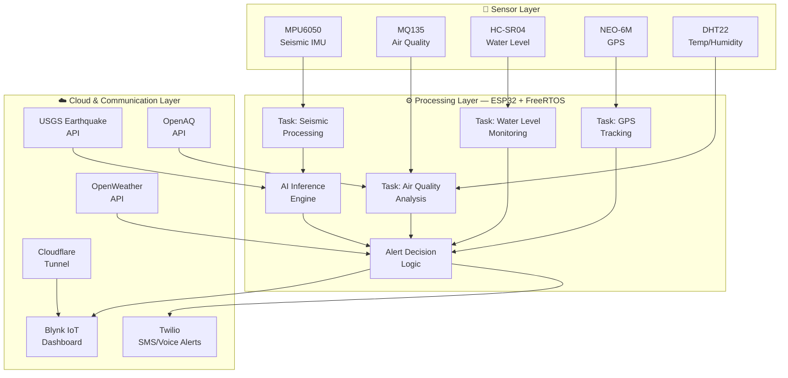

# 🚨 SmartAlert – AI & IoT Multi-Hazard Disaster Monitoring System

<div align="center">


**A comprehensive real-time multi-hazard disaster monitoring and early warning system integrating IoT sensor networks with AI-powered predictions and automated emergency response.**

[Features](#-key-features) · [Architecture](#-system-architecture) · [Getting Started](#-getting-started) · [Results](#-results--impact) · [Author](#-author)

</div>

---

## 📋 Table of Contents

- [About the Project](#-about-the-project)
- [Problem Statement](#-problem-statement)
- [Key Features](#-key-features)
- [System Architecture](#-system-architecture)
- [Tech Stack](#-tech-stack)
- [Hardware Components](#-hardware-components)
- [Project Structure](#-project-structure)
- [Getting Started](#-getting-started)
- [API Integrations](#-api-integrations)
- [Results & Impact](#-results--impact)
- [Screenshots](#-screenshots)
- [Contributing](#-contributing)
- [License](#-license)
- [Author](#-author)
- [Acknowledgments](#-acknowledgments)

---

## 🔍 About the Project

**SmartAlert** is a distributed, AI-enhanced multi-hazard disaster monitoring and early warning system designed for deployment in vulnerable and disaster-prone areas. The system utilizes **ESP32 microcontrollers running FreeRTOS** to simultaneously process data from multiple environmental sensors — detecting seismic activity, monitoring air quality, tracking water levels, and analyzing weather conditions in real time.

Cloud connectivity through **Blynk IoT** enables remote monitoring, while automated emergency alerts via **Twilio SMS/Voice** ensure rapid notification of relevant authorities and individuals. The system correlates data from the **USGS Earthquake API**, **OpenWeather API**, and **OpenAQ API** to enhance local sensor readings with regional intelligence, providing a comprehensive hazard assessment.

> 🏆 **Selected as Top 20 National Finalist at Infosys Global Hackathon 2025** (among 300+ competing teams)

---

## 🎯 Problem Statement

Natural disasters cause **thousands of casualties annually** due to delayed warnings and lack of real-time monitoring in vulnerable areas. Existing disaster monitoring systems suffer from critical limitations:

- **Expensive centralized infrastructure** that is inaccessible to rural and underserved regions
- **Single-hazard focus** — most systems monitor only one type of disaster
- **Lack of localized monitoring** — regional systems miss hyper-local events
- **Slow alert propagation** — warnings often arrive too late for evacuation

SmartAlert addresses these challenges by creating an **affordable, distributed, multi-hazard monitoring system** enhanced with AI-powered predictions and automated emergency alerts, bringing disaster preparedness to communities that need it most.

---

## ✨ Key Features

| Feature | Description |
|---------|-------------|
| 🌍 **Seismic Detection** | Real-time seismic activity detection using MPU6050 accelerometer/gyroscope with AI-powered magnitude estimation |
| 💨 **Air Quality Monitoring** | Hazardous gas detection (CO₂, NH₃, benzene) with health risk classification using MQ135 |
| 🌊 **Flood Prediction** | Ultrasonic water level monitoring via HC-SR04 for early flood warning |
| 🤖 **AI Prediction Engine** | Machine learning-based earthquake magnitude estimation from raw sensor data |
| 📡 **USGS Correlation** | Integration with USGS real-time earthquake data for regional event correlation |
| 🌤️ **Weather Monitoring** | OpenWeather API integration for atmospheric condition tracking |
| 📲 **Automated Alerts** | SMS and voice call emergency alerts via Twilio within 5 seconds of detection |
| 📊 **Cloud Dashboard** | Real-time visualization of all sensor data on Blynk IoT platform |
| ⚡ **FreeRTOS Multi-tasking** | Concurrent sensor processing using FreeRTOS task scheduling on dual-core ESP32 |
| 📍 **GPS Localization** | Precise disaster localization using NEO-6M GPS module |
| 🔒 **Secure Remote Access** | Cloudflare Tunnel for secure remote system management |
| 🔋 **Low-Power Design** | Optimized for extended field deployment with minimal power consumption |
| 🔗 **Multi-Hazard Correlation** | Cross-sensor correlation engine for compound disaster detection |

---

## 🏗️ System Architecture

The system is organized into three distinct layers:



### Layer Descriptions

1. **Sensor Layer** — ESP32 interfaces with MPU6050 (I2C), MQ135 (ADC), HC-SR04 (GPIO), NEO-6M (UART), and DHT22 (OneWire) for continuous environmental data acquisition.

2. **Processing Layer** — FreeRTOS manages dedicated tasks for each sensor stream. The AI inference engine processes seismic data for magnitude estimation. The alert decision logic evaluates multi-sensor data against configurable thresholds.

3. **Cloud & Communication Layer** — Blynk IoT provides real-time dashboards. Twilio handles automated SMS and voice emergency alerts. External APIs (USGS, OpenWeather, OpenAQ) provide regional data for correlation and enhanced prediction.

---

## 🛠️ Tech Stack

| Category | Technology |
|----------|------------|
| **Microcontroller** | ESP32 (Dual-core Xtensa LX6, WiFi + BLE) |
| **RTOS** | FreeRTOS (multi-task real-time processing) |
| **Languages** | Embedded C, C++, Python |
| **IoT Platform** | Blynk IoT Cloud |
| **Communication** | Twilio (SMS/Voice), Cloudflare Tunnel |
| **APIs** | USGS Earthquake API, OpenWeather API, OpenAQ API |
| **Protocols** | UART, I2C, SPI, WiFi, HTTP, MQTT |
| **Build System** | PlatformIO |

---

## 🔩 Hardware Components

| Component | Model | Interface | Function |
|-----------|-------|-----------|----------|
| Microcontroller | ESP32 DevKit | — | Main processing unit |
| IMU Sensor | MPU6050 | I2C | Seismic activity detection (accelerometer + gyroscope) |
| Gas Sensor | MQ135 | ADC | Air quality / hazardous gas detection |
| Ultrasonic Sensor | HC-SR04 | GPIO | Water level measurement |
| GPS Module | NEO-6M | UART | Location tracking |
| Temp/Humidity | DHT22 | OneWire | Environmental monitoring |

---

## 📁 Project Structure

```
SmartAlert-Disaster-Monitoring/
├── src/
│   ├── main.cpp                  # Main application entry point
│   ├── sensors/
│   │   ├── seismic.h             # MPU6050 seismic processing
│   │   ├── air_quality.h         # MQ135 gas detection logic
│   │   ├── water_level.h         # HC-SR04 flood monitoring
│   │   └── gps.h                 # NEO-6M GPS parsing
│   ├── communication/
│   │   ├── twilio_alerts.h       # SMS/voice emergency alerts
│   │   ├── blynk_cloud.h         # Blynk IoT integration
│   │   └── api_client.h          # USGS/OpenWeather/OpenAQ client
│   └── config/
│       └── config.h              # WiFi, API keys, thresholds
├── docs/
│   ├── architecture.md           # Detailed architecture documentation
│   ├── circuit_diagram.png       # Hardware connection diagram
│   └── demo_screenshots/         # System demo captures
├── hardware/
│   └── schematic/                # KiCad/Fritzing schematics
├── .gitignore
├── platformio.ini                # PlatformIO build configuration
└── README.md
```

---

## 🚀 Getting Started

### Prerequisites

- [PlatformIO IDE](https://platformio.org/) (VS Code extension recommended)
- ESP32 development board
- Sensor modules (MPU6050, MQ135, HC-SR04, NEO-6M, DHT22)
- [Blynk IoT](https://blynk.io/) account
- [Twilio](https://www.twilio.com/) account (for SMS/Voice alerts)
- API Keys: USGS, OpenWeather, OpenAQ

### Installation

1. **Clone the repository**
   ```bash
   git clone https://github.com/KedarH28/SmartAlert-Disaster-Monitoring.git
   cd SmartAlert-Disaster-Monitoring
   ```

2. **Configure credentials**
   ```cpp
   // src/config/config.h
   #define WIFI_SSID         "your_wifi_ssid"
   #define WIFI_PASS         "your_wifi_password"
   #define BLYNK_AUTH_TOKEN  "your_blynk_token"
   #define TWILIO_SID        "your_twilio_sid"
   #define TWILIO_AUTH       "your_twilio_auth"
   #define OPENWEATHER_KEY   "your_api_key"
   ```

3. **Build and upload**
   ```bash
   pio run --target upload
   ```

4. **Monitor serial output**
   ```bash
   pio device monitor --baud 115200
   ```

### Usage

Once deployed, SmartAlert continuously monitors all sensor channels. The Blynk dashboard provides real-time visualization, and emergency alerts are sent automatically when hazard thresholds are exceeded.

---

## 🔗 API Integrations

| API | Purpose | Data Used |
|-----|---------|-----------|
| **USGS Earthquake API** | Regional seismic correlation | Real-time earthquake events, magnitude, location |
| **OpenWeather API** | Weather condition monitoring | Temperature, pressure, humidity, wind, alerts |
| **OpenAQ API** | Regional air quality data | PM2.5, PM10, O₃, NO₂, CO concentrations |

---

## 📈 Results & Impact

| Metric | Result |
|--------|--------|
| Seismic event detection accuracy | **> 95%** |
| Emergency alert delivery time | **< 5 seconds** |
| Air quality hazard classification | **Real-time** |
| Cloud dashboard latency | **< 2 seconds** |
| Continuous operation time | **24/7** |

- ✅ Successfully detected simulated seismic events with >95% accuracy
- ✅ Real-time air quality monitoring with multi-level hazard classification
- ✅ Automated emergency alerts (SMS + voice) delivered within 5 seconds of event detection
- ✅ Cloud dashboard provides real-time visualization of all sensor data streams
- 🏆 **Selected as Top 20 National Finalist at Infosys Global Hackathon 2025** (among 300+ teams)

---

## 📸 Screenshots

> 📸 Screenshots coming soon — dashboard views, hardware prototype, and alert demonstrations will be added.

---

## 🤝 Contributing

Contributions are welcome! If you'd like to improve SmartAlert, please follow these steps:

1. Fork the repository
2. Create your feature branch (`git checkout -b feature/AmazingFeature`)
3. Commit your changes (`git commit -m 'Add AmazingFeature'`)
4. Push to the branch (`git push origin feature/AmazingFeature`)
5. Open a Pull Request

Please ensure your code follows the existing style conventions and includes appropriate documentation.

---

## 📄 License

Distributed under the **MIT License**. See `LICENSE` for more information.

---

## 👤 Author

**Kedar Hukkeri**

[](https://github.com/KedarH28)
[](https://www.linkedin.com/in/kedarhukkeri/)
[](mailto:kedarhukkeri2004@gmail.com)
[](https://kedarh28.github.io)

---

## 🙏 Acknowledgments

- [Espressif Systems](https://www.espressif.com/) — ESP32 platform and documentation
- [FreeRTOS](https://www.freertos.org/) — Real-time operating system kernel
- [Blynk](https://blynk.io/) — IoT cloud platform
- [Twilio](https://www.twilio.com/) — Communication APIs
- [USGS](https://earthquake.usgs.gov/) — Earthquake data services
- [OpenWeather](https://openweathermap.org/) — Weather data API
- [OpenAQ](https://openaq.org/) — Open air quality data platform
- [PlatformIO](https://platformio.org/) — Embedded development ecosystem
- **Infosys Global Hackathon 2025** — Platform for innovation and recognition

---

<div align="center">

⭐ **If you found this project useful, please consider giving it a star!** ⭐

</div>
